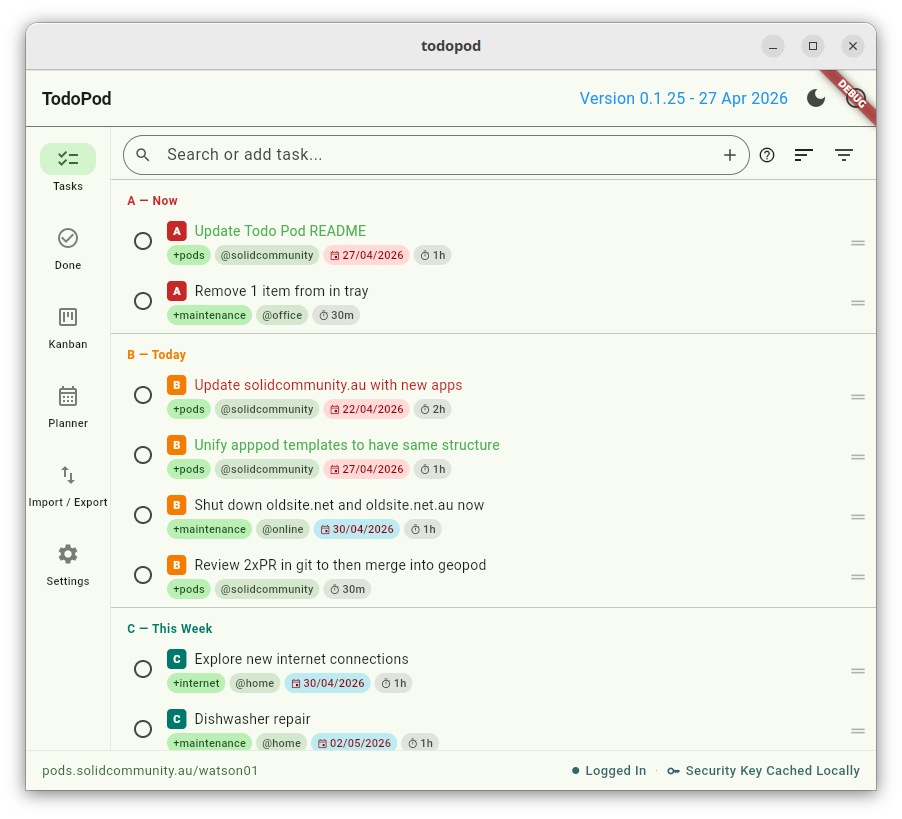
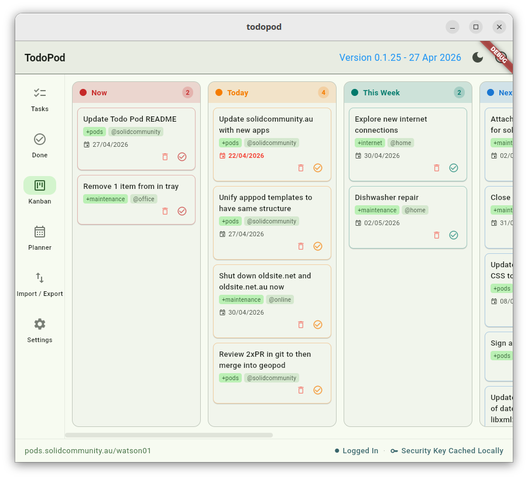
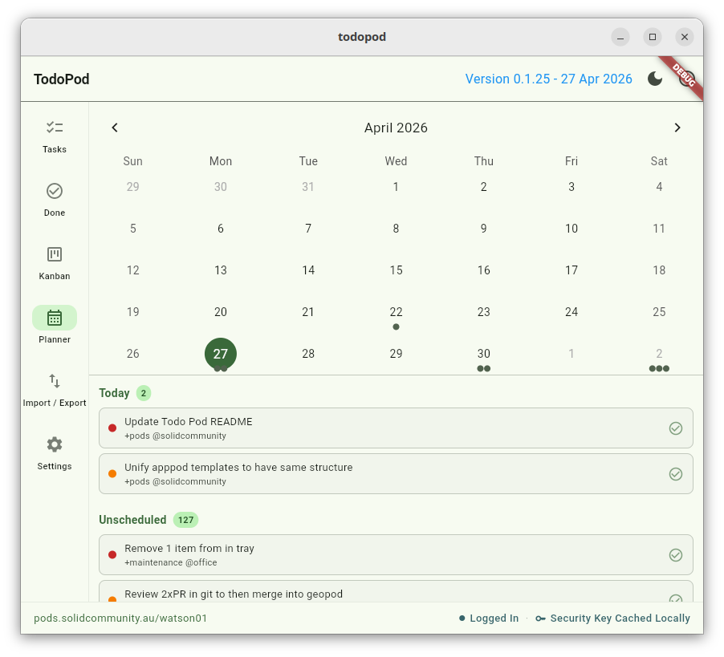
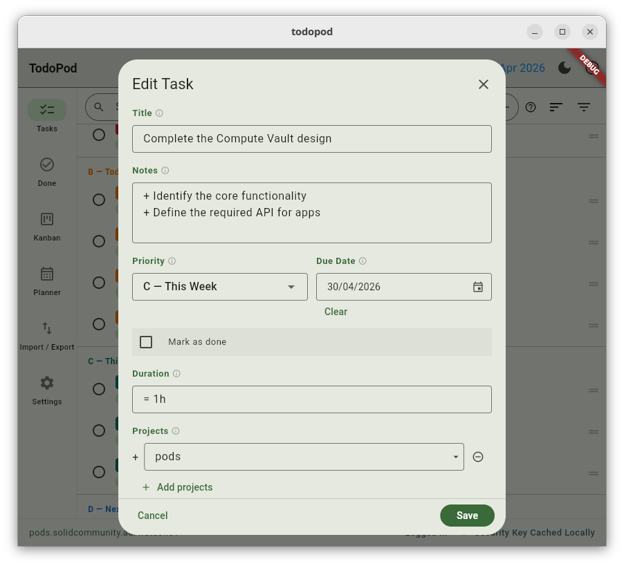
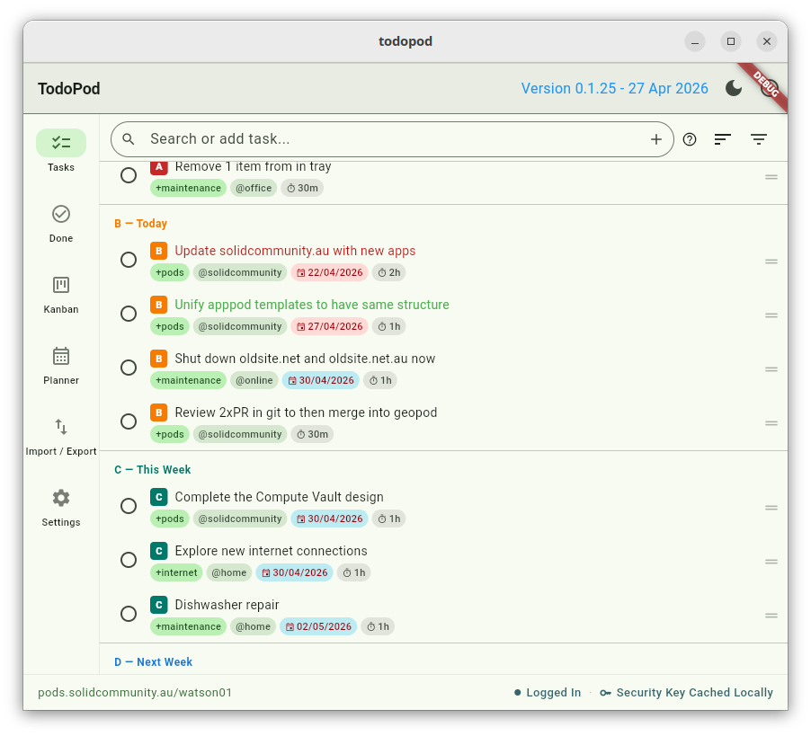
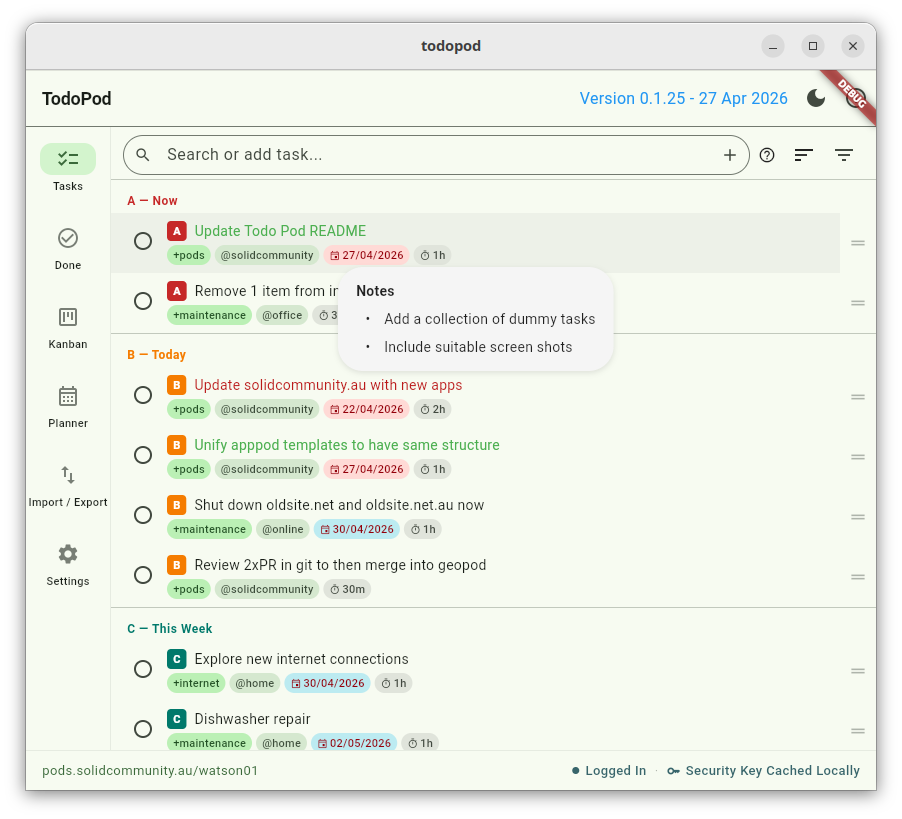

# TodoPod

> Task Management with Secure and Private Solid Pod Storage

[TodoPod](https://gjwgit.github.io/todopod/) is a Trello-like app that
manages your tasks, viewing tasks through a task list, kanban, or
planner. All tasks are securely and privately stored encrypted on your
own personal online data store
([Pod](https://solidproject.org/about)). Your Pod sits in a personal
Data Vault on a Solid server in the cloud, where everything is stored
encrypted and stays within the Pod. No data leaves the Pod unless you
explicitly export it, so you stay in control. The app is supported by
[Togaware](https://togaware.com) and implemented by [Graham
Williams](https://togaware.com/Graham.Williams.html) pair coding with
[Claude Code](https://claude.com/product/claude-code) using
[Flutter](https://flutter.dev)'s
[SolidUI](https://github.com/anusii/solidui) package for cross
platform development.

Solid Pods are a new approach to handling your personal data on the
World Wide Web and is the latest innovation from the inventor of the
WWW, Sir Tim Berners-Lee. Obtain a Pod for yourself on any Solid
server and link it to your app.

We make this project available for free so if you appreciate the app
then please show some ❤️ and tap on the star at
[GitHub](https://github.com/gjwgit/todopod) to support our work. See
the [AU Solid Community](https://solidcommunity.au) **showcase** for
many more apps using the Solid ecosystem.

The latest version of the app can be run online at
[todopod.solidcommunity.au](https://todopod.solidcommunity.au) with no
installation required though requiring a Solid login, or downloaded
and installed for your platform from the [Solid Community
AU](https://solidcommunity.au) repository:

<!-- markdownlint-disable MD036 -->
+ **Web**
  [solidcommunity](https://todopod.solidcommunity.au/);
+ **Android**
  [aab](https://solidcommunity.au/installers/todopod.aab) or
  [apk](https://solidcommunity.au/installers/todopod.apk);
+ **GNU/Linux**
  [deb](https://solidcommunity.au/installers/todopod_amd64.deb) or
  [snap](https://solidcommunity.au/installers/todopod_amd64.snap) or
  [zip](https://solidcommunity.au/installers/todopod-linux.zip);
+ **macOS**
  [dmg](https://solidcommunity.au/installers/todopod-macos.dmg) or
  [zip](https://solidcommunity.au/installers/todopod-macos.zip);
+ **Windows**
  [inno](https://solidcommunity.au/installers/todopod-windows-inno.exe) or
  [zip](https://solidcommunity.au/installers/todopod-windows.zip).

[Installation
details](https://github.com/gjwgit/todopod/blob/dev/installers/README.md)
are available for all platforms.

Contributions are welcome. Visit
[github](https://github.com/gjwgit/todopod) to submit an issue or,
even better, fork the repository yourself, update the code, and submit
a Pull Request. The app is implemented in
[Flutter](https://flutter.dev) using
[solidui](https://pub.dev/packages/solidui). Thanks.

## Introduction

TodoPod is a Trello-like Solid Flutter app to manage todo/task lists
based on the open standard todo.txt format. Tasks can be imported and
exported from other apps using the todo.txt format. Each item has a
title, notes, priority (A=now, B=today, C=this week, D=next week,
E=later, and F=parked), together with optional due date, duration,
project (to collect together related tasks), and a context (where the
task is to be undertaken). You can view your tasks in an ordered list,
a kanban board, or as a planner/calendar. The app is multi-platform so
you can install it for your desktop or mobile device, or run it
directly through a web browser, all accessing and updating the tasks
encrypted within your Pod.

---

## Quick start

The typical workflow is:

1. **Add** a task by typing in the search bar and pressing ENTER, or
   by tapping the **+** button. Anything you type becomes the new
   task's title.
2. **Set a priority** (A through F) and any optional due date,
   duration, project tag, or context.
3. **Work through** your tasks in the view that suits you — the
   ordered list, the kanban board, or the planner calendar.
4. **Complete** a task by tapping its checkbox. It moves to the
   **Done** list, where you can restore it with another tap if you
   change your mind.

---

## The six screens

A left-hand menu (or bottom navigation on narrow screens) gives you:

### Tasks

Your todo list, ordered by priority. The main place you spend time.

### Kanban

A board view showing tasks grouped by priority (A through F). Long-press
and drag a card to change its priority — useful for quickly reshuffling
what's most important.

### Planner

A calendar view of tasks by due date. Tap a day to see what is due
that day. Good for spotting a heavy week ahead.

### Done

Completed tasks, kept for record-keeping. Tap the checkbox of any
completed task to restore it to your active list.

### Import / Export

Bring tasks in from a todo.txt or JSON file, or save a backup. See
[Backup and import](#backup-and-import) below.

### Settings

A priority guide, sharing preferences, and other app settings.

---

## Adding and editing a task

New tasks are added by typing in the **search bar** and pressing ENTER
— whatever you type becomes the title — or by tapping the **+** icon.

After saving, the task appears in the list:

The edit form captures:

+ **Title** — the headline description of the task
+ **Notes** — free-text detail, multi-line
+ **Priority** — A (now), B (today), C (this week), D (next week),
  E (later), F (parked)
+ **Due date** — optional
+ **Duration** — estimated time the task will take
+ **Projects** — tags collecting related tasks (todo.txt `+project`
  syntax)
+ **Contexts** — tags for where the task is done, e.g. `@home`,
  `@phone` (todo.txt `@context` syntax)

Tap any task to edit it. The same form opens.

---

## Working with tasks in the list

Hover over a task (desktop) or long-press (mobile) to see its full
details inline:

Other gestures:

+ **Tap** — open the task to edit.
+ **Tap the checkbox** — mark complete; the task moves to **Done**.
+ **Drag the right-hand handle** — reorder a task within the list.
+ **Swipe left** — delete the task (with confirmation).
+ **Delete icon** — the in-row delete button (same effect as swipe).

---

## Search

The search bar at the top of the Tasks screen matches plain text
against the task title, notes, and tags. Type to filter; press ENTER
on an unmatched query to create a new task from that text.

Clear the search with the × on the right of the field, or just delete
the text. The list updates as you type.

---

## Sharing tasks with others

TodoPod supports sharing your task lists with other Solid Pod owners.
Open **Settings** to:

+ **Manage Todo.txt permissions** — grant or revoke another WebID's
  access to your active task list.
+ **Manage Done.txt permissions** — grant or revoke access to your
  completed task list separately, so you can share one without the
  other.
+ **View shared resources** — open task lists that other Pod owners
  have shared with you.

Permission level (read-only or read/write) is controlled per WebID
through the standard Solid permission flow.

---

## Backup and import

TodoPod uses the open [todo.txt](https://todotxt.github.io/) format, so your
tasks are not locked into the app. You can:

+ **Import from todo.txt** — bring tasks in from any todo.txt-compatible
  app. New items are merged; duplicates (matching ID) are skipped.
+ **Import from JSON** — restore from a TodoPod JSON backup.
+ **Export to todo.txt** — saves a `todo.txt` file ready to share with
  other todo.txt apps.
+ **Export to JSON** — saves a full TodoPod backup with all metadata.

Exports save with timestamped filenames (e.g.
`todopod_backup_20260520_1430.txt`) so you can keep multiple
snapshots.

---

## About info

Tap the **info** (ℹ) button in the top app bar at any time to see a
brief about-the-app dialog with the version number and a short
summary of how TodoPod works.

---

## Data and privacy

All tasks are stored in your Solid Pod as Turtle files (`todo.ttl`
for active tasks and `done.ttl` for completed ones) in the
`todopod/` directory. You authenticate to your Pod when you start
the app, and your security key (used to read and write the encrypted
data) is managed through the standard SolidPod flow shown in the
status bar.

If you log into a fresh Pod, TodoPod creates the directory and empty
task files on first save. Nothing about your tasks ever leaves your
Pod unless you explicitly share it with another Pod or you export it
as todo.txt or JSON.

---

## License

GNU General Public License v3. See `LICENSE` or
<https://opensource.org/license/gpl-3-0>.

Copyright (C) 2026, Togaware Pty Ltd.
